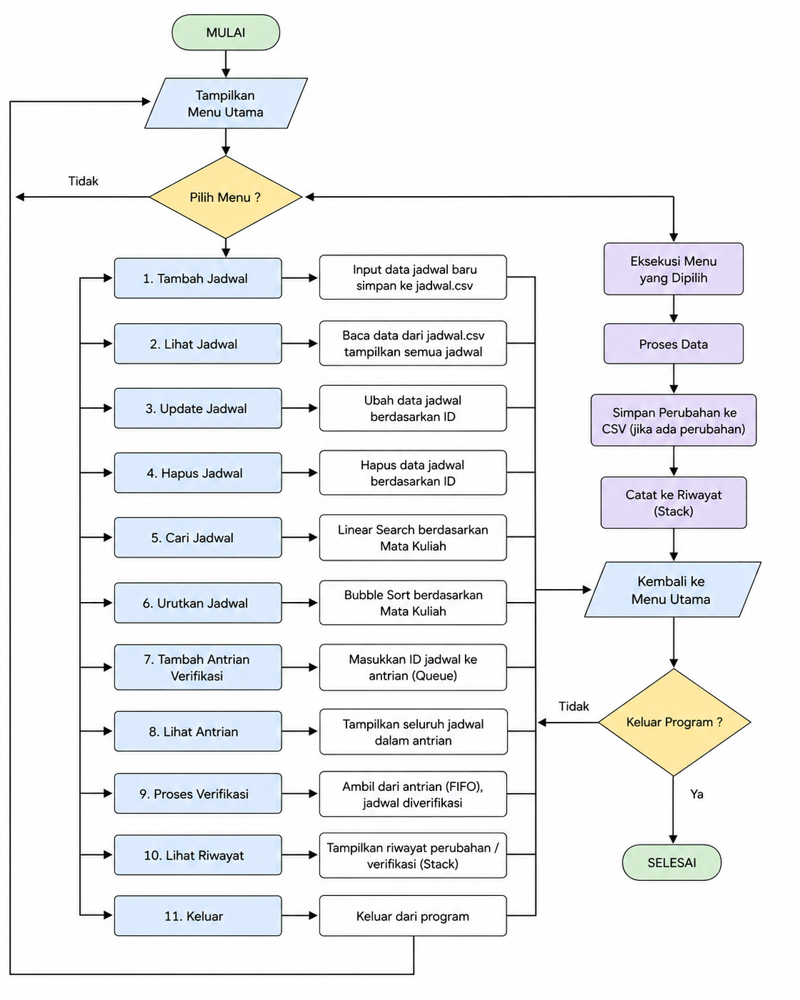

# SISTEM PENJADWALAN KULIAH BERBASIS CSV MENGGUNAKAN PYTHON

## Identitas Mahasiswa

Nama : Dian Srirahayu

NIM : 25416255201020

## Deskripsi Proyek

Sistem Penjadwalan Kuliah merupakan aplikasi berbasis Command Line Interface (CLI) yang dikembangkan menggunakan bahasa pemrograman Python dengan media penyimpanan data berupa file CSV. Aplikasi ini digunakan untuk mengelola data jadwal perkuliahan secara sederhana tanpa menggunakan database seperti MySQL atau PostgreSQL.

Melalui aplikasi ini, pengguna dapat melakukan pengelolaan jadwal kuliah yang meliputi penambahan data, melihat data, mengubah data, menghapus data, pencarian data, pengurutan data, serta proses verifikasi jadwal yang memanfaatkan struktur data Queue dan Stack.

## Flowchart Sistem

Flowchart sistem menggambarkan alur kerja aplikasi mulai dari menampilkan menu utama, pengelolaan jadwal, proses pencarian dan pengurutan data, hingga proses verifikasi jadwal dan penyimpanan riwayat aktivitas.

Simpan gambar flowchart yang telah dibuat dengan nama:

```text id="m7j2md"
flowchart.png
```


Berikut adalah flowchart alur kerja aplikasi sistem penjadwalan kuliah

<p align="center">
  
</p>


## Tujuan Proyek

Tujuan dari pembuatan aplikasi ini adalah:

1. Mengimplementasikan operasi CRUD menggunakan Python.
2. Menggunakan file CSV sebagai media penyimpanan data.
3. Mengimplementasikan struktur data Queue, Stack, dan Dictionary.
4. Mengimplementasikan algoritma Searching dan Sorting.
5. Mengembangkan aplikasi penjadwalan kuliah berbasis Command Line Interface.

## Fitur Sistem

Aplikasi memiliki beberapa fitur utama sebagai berikut:

1. Tambah Jadwal Kuliah
2. Lihat Jadwal Kuliah
3. Update Jadwal Kuliah
4. Hapus Jadwal Kuliah
5. Cari Jadwal Kuliah
6. Urutkan Jadwal Kuliah
7. Tambah Antrian Verifikasi Jadwal
8. Lihat Antrian Verifikasi
9. Proses Verifikasi Jadwal
10. Lihat Riwayat Aktivitas
11. Keluar

## Struktur Folder

```text id="3v4z2m"
penjadwalan_kuliah/
│
├── assets/
│   └── flowchart.png
│
├── modules/
│   ├── crud.py
│   ├── csv_handler.py
│   ├── searching.py
│   ├── sorting.py
│   ├── queue_jadwal.py
│   └── riwayat.py
│
├── main.py
├── jadwal.csv
├── riwayat_jadwal.csv
└── README.md
```

## Struktur Data yang Digunakan

### Dictionary (Hash Map)

Dictionary digunakan untuk menyimpan data jadwal kuliah yang dibaca dari file CSV sehingga memudahkan proses CRUD dan pengolahan data.

Contoh:

```python id="3oq0iw"
{
    "id_jadwal": "J001",
    "matkul": "Struktur Data",
    "dosen": "Dr Ahmad",
    "hari": "Senin",
    "jam": "08:00-10:00",
    "ruangan": "Lab 1"
}
```

### Queue

Queue digunakan sebagai antrean verifikasi jadwal. Jadwal yang masuk terlebih dahulu akan diproses terlebih dahulu sesuai konsep FIFO (First In First Out).

### Stack

Stack digunakan untuk menyimpan riwayat aktivitas verifikasi jadwal sehingga aktivitas terakhir dapat dilihat terlebih dahulu sesuai konsep LIFO (Last In First Out).

## Algoritma yang Digunakan

### Linear Search

Linear Search digunakan untuk mencari data mata kuliah berdasarkan kata kunci yang dimasukkan pengguna.

### Bubble Sort

Bubble Sort digunakan untuk mengurutkan data mata kuliah berdasarkan nama mata kuliah secara alfabetis.

## Penyimpanan Data

### jadwal.csv

File ini digunakan untuk menyimpan seluruh data jadwal kuliah.

Struktur data:

```text id="cr8vut"
id_jadwal,matkul,dosen,hari,jam,ruangan
```

### riwayat_jadwal.csv

File ini digunakan untuk menyimpan data riwayat aktivitas verifikasi jadwal.

Struktur data:

```text id="rwc6ny"
id_riwayat,aktivitas
```

## Implementasi CRUD

### Create

Menambahkan data jadwal kuliah baru ke dalam sistem.

### Read

Menampilkan seluruh data jadwal kuliah yang tersimpan.

### Update

Mengubah data jadwal berdasarkan ID jadwal.

### Delete

Menghapus data jadwal berdasarkan ID jadwal.

## Cara Menjalankan Program

Pastikan Python versi 3 telah terpasang pada komputer.

Masuk ke folder project:

```bash id="tfuy3g"
cd penjadwalan_kuliah
```

Jalankan program:

```bash id="fip5mt"
python main.py
```

atau

```bash id="8s7fpk"
python3 main.py
```

## Struktur Data dan Algoritma yang Diimplementasikan

| Komponen      | Implementasi              |
| ------------- | ------------------------- |
| CRUD          | Data Jadwal Kuliah        |
| CSV           | jadwal.csv                |
| Dictionary    | Penyimpanan Data Jadwal   |
| Queue         | Antrian Verifikasi Jadwal |
| Stack         | Riwayat Aktivitas         |
| Linear Search | Pencarian Mata Kuliah     |
| Bubble Sort   | Pengurutan Mata Kuliah    |
| CLI           | Antarmuka Program         |

## Kesimpulan

Sistem Penjadwalan Kuliah berbasis CSV merupakan aplikasi sederhana yang mampu mengelola data jadwal perkuliahan melalui operasi CRUD serta memanfaatkan struktur data dan algoritma yang telah dipelajari pada mata kuliah Struktur Data. Sistem ini menggunakan Queue untuk proses verifikasi jadwal, Stack untuk penyimpanan riwayat aktivitas, Dictionary untuk penyimpanan data, serta Linear Search dan Bubble Sort untuk pencarian dan pengurutan data. Dengan memanfaatkan file CSV sebagai media penyimpanan, aplikasi dapat dijalankan tanpa memerlukan sistem basis data tambahan.
